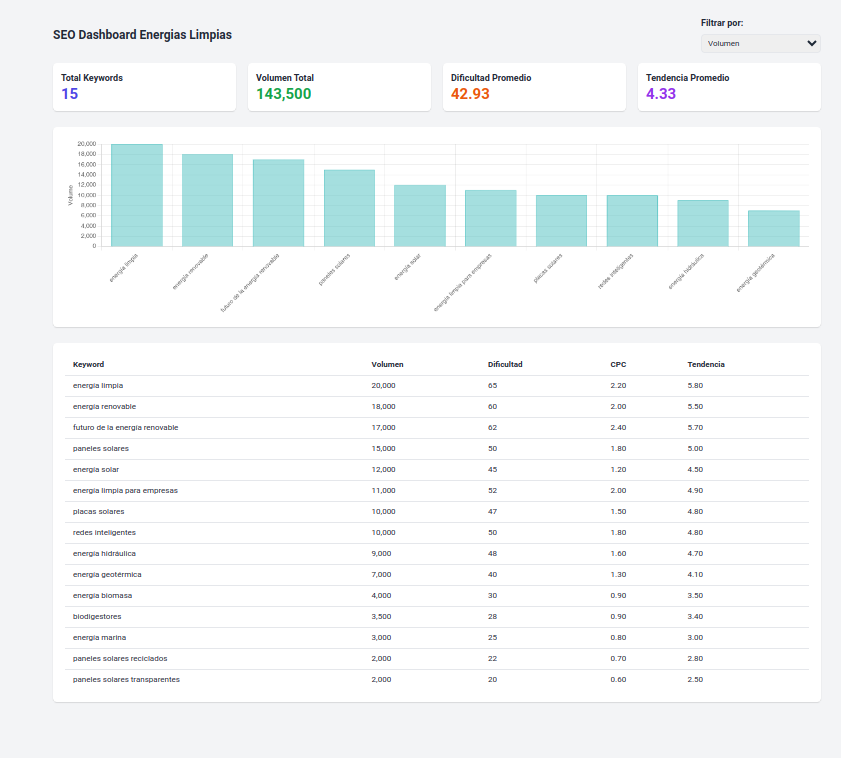

# SEO Dashboard - Clean Energy Keywords

Este proyecto consiste en la creación de una visualización simple de datos SEO relacionada con el nicho de **energías limpias**. El objetivo principal es mostrar un dashboard que incluya un resumen de métricas y una tabla ordenada de palabras clave por volumen de búsqueda.

---

## 🎯 **Objetivo**
1. Crear un API que retorne datos de keywords ordenados por volumen de búsqueda.
2. Desarrollar un dashboard simple con **Tailwind CSS** para visualizar los datos.

---

## 🚀 **Características principales**
- **API Endpoint:**
  - Devuelve un listado de palabras clave desde un archivo JSON.
  - Ordena los resultados por volumen de búsqueda en orden descendente.
  - Datos en memoria (sin base de datos).

- **Dashboard:**
  - Incluye una tarjeta resumen con métricas totales.
  - Tabla interactiva que muestra palabras clave, volúmenes de búsqueda, dificultad y CPC.
  - Estilo moderno y responsive utilizando **Tailwind CSS**
  
  ## 🛠️ **Tecnologías utilizadas**
- **Frontend:** HTML, JavaScript, Tailwind CSS.
- **API:** Node.js (Express).
- **Datos:** Archivo JSON estático.

---


## 📊 **Vista previa del dashboard**


---

## 🧪 **Cómo ejecutar el proyecto**
1. Clonar el repositorio:
   ```bash
   git clone https://github.com/marya277/dashboard-SEO.git
   cd seo-dashboard
   ```

2. Instalar dependencias:
   ```bash
   npm install
   ```

3. Iniciar el servidor:
   ```bash
   node server.js
   ```

4. Accede al dashboard en tu navegador:
   ```
   http://localhost:3000
   ```

---

## 📦 **Endpoint del API**
- **URL:** `/api/keywords`
- **Método:** GET
- **Descripción:** Retorna un array de objetos con las palabras clave ordenadas por volumen de búsqueda.

---
## 📌 **Notas adicionales**
- El proyecto es escalable y puede adaptarse para usar una base de datos si se requiere.
- El archivo JSON puede ser actualizado fácilmente para incluir nuevos datos.
